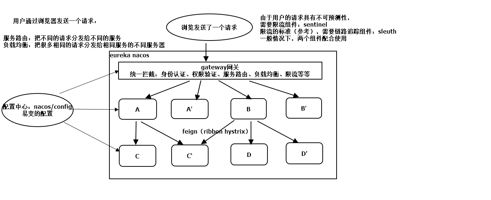

## 组件
注册中心：eureka nacos zookeeper	
负载均衡组件：ribbon（默认就是轮询算法）
熔断组件：hystrix
分布式流控组件：sentinel
服务调用组件：feign（RestTemplate ribbon hystrix）
网关组件：gateway(-webflux)  （zuul网关-servlet）
配置中心组件：nacos config(官方) Apollo（携程）
链路追踪组件：sleuth

### sentinel概念
资源：方法的url或者是服务名
规则：围绕资源的实时状态设定规则
	
**限流**：	
限流3个维度：
1. 资源与资源之间的关系：直接 关联 链路
2. 运行指标：QPS 线程数
3. 流控效果：快速失败 冷启动（warm up） 排队等待

**限流演示**：
1. 快速失败
2. warm up：冷启动，服务器之前处于空闲状态，如果并发量突然达到最大并发量
3. 匀速排队：可以设置单机阈值和排队等待时间，超过等待时间请求才会被限流
4. 关联限流：当关联的资源达到阈值时，就限流自己
5. 链路限流：针对同一资源的不同入口，进行限流
6. 线程数限流：当线程数超过指定的阈值，就会限流
	
**降级演示**：
1. RT（平均响应时间）：1s之内连续5次请求响应时间大于RT时间，那么在接下来的时间窗口内（10s）所有请求会被降级
2. 异常比例：1s之内超过5次请求，请求失败的比例大于设置的异常比例，在接下来的时间窗口内所有请求会被降级
3. 异常数：1min之内异常数据大于设置的异常数，就会降级

**规则持久化**：因为资源服务器一旦重启，规则就删除
1. 引入sentinel整合nacos持久化的依赖
2. 配置nacos的信息：地址 名称空间 分组  dataId 配置类型 规则类型（flow degrade）
3. 在nacos中配置流控规则
		
**sleuth**：链路追踪组件
	span：跨度，一次远程请求就是一个span。有一个64位的唯一标识
	trance：踪迹，多个span组成一个树状的trance。有一个64位的唯一标识
	
## springCloud体系结构

    注册中心：eureka nacos zookeeper	
    负载均衡组件：ribbon（默认就是轮询算法）
    熔断组件：hystrix
    分布式流控组件：sentinel
    服务调用组件：feign（RestTemplate ribbon hystrix）
    网关组件：gateway(-webflux)  （zuul网关-servlet）
    配置中心组件：nacos config(官方) Apollo（携程）
    链路追踪组件：sleuth
	
**搭建微服务步骤：**
		
        1.创建了两个工程：consumer 和 provider
		2.把这两个工程注入《nacos注册中心》
			1.在pom.xml中：引入nacos-discovery启动器
			2.applicaton.properties: 
				spring.cloud.nacos.discovery.server-addr=localhost:8848
			3.在启动类上
				@EnableDiscoveryClient可略
		3.编写了consumer和provider的相关代码
		4.在provider中添加了一个易变配置：myName=nacos
		5.把易变的配置放入《nacos配置中心》
			1.在pom.xml中：引入nacos-config启动器
			2.bootstrap.properties：
				spring.applicaton.name=服务名
				spring.cloud.nacos.config.server-addr=localhost:8848
				spring.cloud.nacos.config.namespace=xxxx
				spring.cloud.nacos.config.group=dev/test/product
				spring.cloud.nacos.config.file-extension=properties/yml
			3.在使用配置内容的类上添加注解：@RefreshScope
		6.创建《gateway网关》工程，通过网关访问服务：
			1.在pom.xml中：引入gateway的启动器
			2.在application.yml中配置路由信息
				spring.applicaton.name=服务名
				spring.cloud.nacos.discovery.server-addr=localhost:8848
				spring:
					cloud:
						gateway:
							routes:
							- id: consumer-route
							  uri: lb://服务名
							  predicates:
							  - Path=/consumer/**
							  filters:
		7.整合sentinel
			1.feign整合：
				pom.xml中引入了sentinel的启动器以及feign的启动器
				application.properties中开启feign的sentinel熔断功能：feign.sentinel.enable=true
				编写熔断类实现FeignClient接口，在@FeignClient(value="服务名", fallback=熔断类.class)
			2.流量控制：
				资源：url 服务名
				规则：针对资源的实时状态制定相应流控
				sentinel分两部分：核心库和dashboard客户端
				分3个维度进行流控：
					1.资源之间关系：直接 关联 链路
					2.运行指标：QPS 线程数
					3.流控效果：快速失败 warm up（冷启动） 匀速排队
			3.降级：
				RT：平均响应时间。1s之内连续5个请求超过阈值，在接下来的时间窗口内所有请求会被降级
				异常比例：1s之内超过5次请求，请求失败的比例大于阈值，在接下来的时间窗口内所有请求会被降级
				异常数：1min之内异常数据大于阈值，就会降级
			4.规则持久化
				1.引入sentinel整合nacos的依赖
				2.在application.properties中：
					spring.cloud.sentinel.datasource.xxx.nacos.server-addr=localhost:8848
					spring.cloud.sentinel.datasource.xxx.nacos.namespace=名称空间
					spring.cloud.sentinel.datasource.xxx.nacos.group=dev/test/product
					spring.cloud.sentinel.datasource.xxx.nacos.dataId=配置名
					spring.cloud.sentinel.datasource.xxx.nacos.type=json
					spring.cloud.sentinel.datasource.xxx.nacos.rule-type=flow/degrade
				3.在nacos中制定规则
				
		8.整合sleuth
			前提把zipkin启动起来
			1.引入zipkin启动器
			2.在application.properties中
				spring.zipkin.base-url=http://localhost:9411
				spring.zipkin.discovery-client-enable=false
				spring.zipkin.sender.type=web/active/rabbit/kafka
				spring.sleuth.sampler.probability=1
			概念：
				span：跨度，一次远程请求就是一个span。有一个64位的唯一标识
				trance：踪迹，多个span组成一个树状的trance。有一个64位的唯一标识

	
	
	